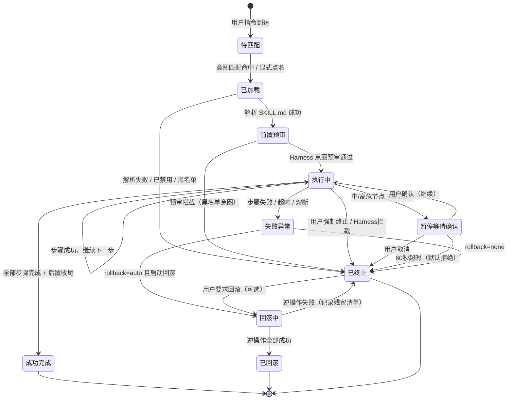
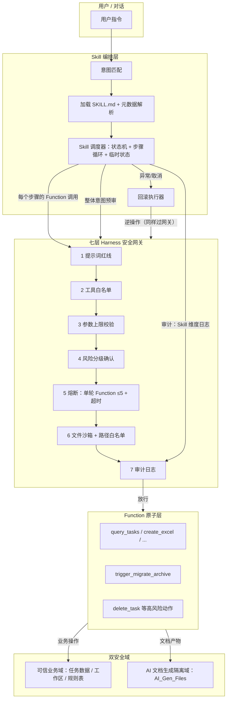

# WMessage 机器人 Skill 运行模型（生命周期 + 调度机制）

> 版本 v1.0 · 2026-08-16 · 设计文档（运行框架定义，不含具体业务 Skill 开发）
> 配套：`SPEC.md`（产品规格）、`src-tauri/src/bot_skills.rs`（技能装载层，已实现）、`src-tauri/src/bot.rs`（Harness 网关 + Function 工具集）

---

## 1. Skill 运行模型总述

**一句话定义**：Skill 是「意图可匹配、整体先预审、步骤逐条过 Harness 七层网关、高危节点挂起等人工确认、可暂停可回滚可终止」的多步 Function 编排单元——上层编排的是顺序，安全底线完全由底层 Harness 与双安全域承接，Skill 自始至终没有任何绕过通道。

与现有 Function 的关系：

| 层 | 定义 | 例子 | 执行方 |
|---|---|---|---|
| Function | 最小原子单次动作 | query_tasks、create_excel、trigger_migrate_archive | Harness 直接放行后执行 |
| Skill | 编排好的复合技能：多步 Function + 状态 + 分支 + 前置/后置校验 | 「汇总今日 + 归档待办」 | Skill 调度器逐步骤驱动 Function |

---

## 2. Skill 元数据标准规范

每个 Skill 自带的配置，写在 `SKILL.md` 的 YAML frontmatter（现有技能装载层已支持 `name` / `description`，运行模型在此基础上扩展字段，全部有默认值，老技能不加新字段也能跑）：

| 字段 | 类型 | 必填 | 默认 | 说明 |
|---|---|---|---|---|
| `name` | string | ✅ | 目录名 | 唯一标识；白名单字符 `[A-Za-z0-9_-]`（防路径穿越，已实现） |
| `version` | string | — | `1.0.0` | 版本隔离：同名不同版本不互相覆盖，禁用按 name 或 name@version |
| `description` | string | ✅ | 空 | 触发描述（注入提示词的技能清单用） |
| `intents` | string[] | — | `[]` | 触发意图标签（如 `["日报","总结","归档"]`），用于意图匹配层 |
| `risk_level` | enum | — | `medium` | `low` / `medium` / `high`，Skill 整体风险定级 → 决定运行模式与预审强度 |
| `mode` | enum | — | 按风险推导 | `auto`（自动编排）/ `interactive`（人机协同）；显式标记优先于风险推导 |
| `max_steps` | int | — | `8` | 本 Skill 最大执行步数（硬上限，防长流程无限循环） |
| `timeout_secs` | int | — | `180` | 本 Skill 最长运行超时（到点强制进入异常分支） |
| `resumable` | bool | — | `false` | 是否支持暂停后断点续跑（true 时暂停保存进度，false 时暂停即终止） |
| `rollback` | enum | — | `none` | `none` 不可回滚 / `auto` 支持逆操作回滚；`auto` 时正文必须含「回滚」章节 |
| `enabled` | bool | — | `true` | 启用/禁用开关（禁用只影响本 Skill，不影响底层 Function） |
| `disabled_reason` | string | — | 空 | 禁用原因记录（黑名单技能填写，审计可见） |
| `precheck` | string | — | 空 | 前置预审补充规则说明（供 Harness 意图预审层读取，如"本 Skill 不得触碰回收站任务"） |

正文结构约定（运行模型只约定骨架，不限制内容写法）：

```
## 步骤（Steps）
每一步：编号 + 意图（做什么）+ 调用的 Function 名 + 参数说明 + 成功分支 + 失败分支
## 前置校验（Precheck）
启动前要确认的条件（数据存在性、状态合法性等）
## 回滚（Rollback，仅 rollback:auto 需要）
逆操作步骤清单，按反序执行
```

---

## 3. Skill 状态机



**状态流转要点**

- `待匹配 → 已加载`：意图匹配命中，或用户在消息里显式点名技能
- `已加载 → 已终止`：SKILL.md 解析失败、技能被禁用或在黑名单 → 终止并告知用户原因
- `前置预审 → 已终止`：Skill 整体意图命中黑名单（全盘遍历、批量无确认删除等）→ **拒绝启动**，日志记 `skill_rejected`
- `暂停等待确认`：仅模式 B 触发；60 秒无人应答自动拒绝并终止（复用现有 `ask_user_confirm` 语义）
- `失败异常`：步骤失败、整体超时、单轮 Function 熔断（5 次上限）任一触发
- 终态四类：`成功完成`、`已回滚`、`已终止`、`失败异常`（`失败异常` 也视为终态，不允许重试入口，重试 = 重新发起 Skill）

---

## 4. 标准执行流水线（固定流水线）

```
① 意图匹配
   用户指令 → 匹配层：intents 标签命中 > 描述关键词命中 > 模型显式选择
   （匹配层只负责"选哪个 Skill"，不做任何安全判断）

② 加载 Skill 定义
   读取 SKILL.md：元数据、步骤清单、分支逻辑、前置校验规则
   → 状态：已加载

③ 全局前置安检（Harness 意图预审层）
   - Skill 整体意图黑名单检查（全盘遍历 / 批量无确认删除 / 越界访问 → 拒绝启动）
   - Skill 风险等级与运行模式校验（high 风险未声明 interactive → 强制降级为 interactive）
   - 前置校验规则（SKILL.md 的 Precheck 章节）执行
   → 通过：进入执行；拦截：已终止 + 审计日志 skill_rejected

④ 初始化 Skill 本地临时状态
   仅本轮对话内有效（内存 Map，不持久化），内容：
   { skill_name, step_index, progress, confirm_pending, start_ts, created_resources[] }
   除非业务需要，不写数据库；对话结束自动丢弃

⑤ 循环分步执行（核心循环）
   for step in steps（受 max_steps 硬上限约束）：
     a. 取出当前步骤 → 映射到底层原子 Function
     b. 该 Function 强走 Harness 七层校验（见第 7 节）——Skill 无权跳过任何一层
     c. 校验通过 → 执行；若是中/高风险动作（模式 B）→ 暂停，等待用户确认
     d. 执行结果 → 写入 Skill 状态 + 全局审计日志（skill 维度）
     e. 分支判断：成功继续下一步 / 条件分支跳转 / 触发异常
   任何一步被 Harness 拦截 = 该 Skill 进入异常分支（不是只跳过当前步）

⑥ 后置收尾
   全部步骤跑完：清理临时状态、汇总结果、输出总结 → 成功完成

⑦ 异常分支
   步骤失败 / 超时 / 用户主动中止 / Harness 拦截：
   - rollback=auto → 询问用户是否回滚（回滚动作本身也逐条过 Harness）
   - rollback=none → 标记不可回滚，日志标注，输出「已执行到第 N 步」清单
```

---

## 5. 两种运行模式

### 模式 A｜自动编排（auto）

- 适用：`risk_level=low` 的只读类、低风险查询类复合流程
- 行为：预审通过后**全程自动跑完**，中途不弹窗；步骤内所有 Function 仍逐条过 Harness，但均为低风险动作（无确认节点）
- 约束：步骤中出现任何中/高风险 Function（动态判断）→ 自动降级为模式 B 行为（该步暂停确认）

### 模式 B｜人机协同（interactive）

- 适用：`risk_level=medium/high`，包含变更、文件操作、批量动作
- 行为：流程中遇到风险节点（删除、归档迁移、批量变更、越域文件操作）自动暂停：
  1. 保存当前进度（第 N 步、已完成动作清单）
  2. 弹出确认（预览待执行动作 + 影响范围），60 秒超时默认拒绝
  3. 确认 → 继续；拒绝/超时 → 终止（已执行部分按 rollback 策略处理）
- `resumable=true` 的 Skill 暂停后可断点续跑；`false` 则暂停即终止

**模式推导规则**：显式 `mode` 字段 > 风险推导（high → interactive；medium → interactive；low → auto）。

---

## 6. 异常、暂停、取消、回滚完整策略

| 场景 | 触发条件 | 行为 | 恢复 |
|---|---|---|---|
| 暂停 | 模式 B 遇到中/高危节点 | 保存进度 → 弹确认（60s 超时默认拒） | 确认后继续 / 拒绝后终止 |
| 取消 | 用户明确拒绝确认 / 发取消指令 | 立即停止后续步骤 | 已执行部分按回滚策略 |
| 强制终止 | 用户随时可终止（`/stop` 语义扩展至 Skill 粒度） | 停止后续所有子步骤，正在执行的 Function 由 StopGuard 中止 | 同上 |
| 步骤失败 | Function 返回错误 | 进入异常分支，不回退已成功步骤 | 按 rollback 字段 |
| 超时 | 超过 `timeout_secs` | 强制进入异常分支 | 按 rollback 字段 |
| 熔断 | 单轮 Function 调用达 5 次上限 / 步数超 max_steps | 立即终止该 Skill | 按 rollback 字段 |
| 回滚 | rollback=auto 且用户同意 | 按「回滚」章节逆序执行逆操作（逐条过 Harness） | 逆操作全成功 → 已回滚；有失败 → 输出残留清单 |
| 不可回滚 | rollback=none | 明确标记不可回滚 + 审计日志标注 | 用户手动补救 |

**回滚铁律**：回滚本身也是 Function 调用序列，同样过 Harness 七层；回滚失败不掩盖——输出「残留资源清单」让用户手动处理。

---

## 7. Skill ↔ Harness ↔ Function ↔ 双安全域联动关系



**联动要点**

- Skill 调度器与 Harness 是**单向依赖**：调度器发起调用，Harness 裁决，不存在反向通道；Skill 无法把某个 Function 标记为"免检"
- 意图预审（Skill 整体）+ 步骤级校验（每个 Function）两级防线叠加
- 双安全域：Skill 步骤产出文档只能落 `AI_Gen_Files`（隔离域），业务数据操作（任务表、规则表、工作区）只能走可信域 Function；**任何单个 Function 不允许跨域写**（现有 `gen_out_path` / `extract_path_allowed` / `link_file_to_task` 白名单已实现域边界）
- Skill 的临时状态（第 4 节）不属于任何安全域——纯内存、会话级、不可被 Function 读写

---

## 8. 禁止项清单（Skill 绝对不允许）

1. ❌ 绕过 Harness 的任何一层（含"本 Skill 已自校验"式自我豁免声明）
2. ❌ 单轮内 Function 调用超过 5 次熔断上限
3. ❌ 无预览、无人工确认的批量删除 / 批量变更 / 文件迁移（无论由模型直呼 Function 还是 Skill 编排触发）
4. ❌ 突破双安全域：把业务域文件移入 AI_Gen_Files 或反之；跨域读写
5. ❌ 无限循环 / 自递归步骤（必须受 max_steps + timeout_secs 双重硬约束）
6. ❌ 写全局持久状态：Skill 中间状态只允许会话级内存，禁止写数据库/文件
7. ❌ 访问其他 Skill 的临时状态或元数据（Skill 之间隔离）
8. ❌ 回滚动作绕过 Harness；回滚失败静默吞掉
9. ❌ 自我提升风险等级权限：低风险 Skill 运行时动态调用高风险 Function 而不暂停
10. ❌ 禁用状态/黑名单 Skill 被任何路径唤起（包括模型 prompt 注入诱导）

---

## 9. 最简示例：「汇总今日 + 归档待办」

**SKILL.md（示意）**

```markdown
---
name: daily-summary-archive
version: 1.0.0
description: 汇总今日任务进展，并把已完成 7 天以上的待办归档
intents: [日报, 汇总, 归档, 今日总结]
risk_level: medium
mode: interactive
max_steps: 6
timeout_secs: 120
resumable: true
rollback: auto
enabled: true
---

## 步骤（Steps）

1. 查询今日任务
   - Function: list_tasks（低风险，只读）
   - 成功 → 步骤 2；失败 → 异常分支
2. 查询可归档任务（完成满 7 天）
   - Function: list_tasks（带归档候选过滤，只读）
   - 无候选 → 跳到步骤 5；有候选 → 步骤 3
3. 【高危节点·暂停确认】预览归档清单
   - 输出候选任务清单，暂停等待用户确认
   - 确认 → 步骤 4；拒绝/超时 → 终止（无需回滚，尚无变更）
4. 执行归档迁移
   - Function: trigger_migrate_archive（中风险：文件移动，已有预览确认）
   - 成功 → 步骤 5；失败 → 异常分支
5. 输出今日汇总
   - 汇总：今日完成数 / 进行中数 / 本次归档数
   - → 成功完成

## 前置校验（Precheck）

- 今日任务数据存在（list_tasks 返回非空，否则提示"今日无任务"并终止）

## 回滚（Rollback）

1. 取消归档：把步骤 4 归档的任务恢复（unarchive，逐条过 Harness）
2. 迁移的文件：按迁移日志记录逆序搬回原路径（失败则输出残留清单）
```

**运行轨迹演示（模式 B）**

```
用户："汇总一下今天，顺便归档到期任务"
→ 意图匹配命中 daily-summary-archive
→ 加载元数据：medium / interactive / max_steps=6 / 可回滚
→ Harness 意图预审：非黑名单意图，放行
→ 初始化临时状态 { step_index:0, created_resources:[] }
→ 步骤1 list_tasks ✅（低风险，不暂停）
→ 步骤2 查询归档候选 ✅（只读）
→ 步骤3 预览清单 → 暂停等待确认 ⏸
   用户点击「确认」→ 继续
→ 步骤4 trigger_migrate_archive ✅（每个文件移动都过 Harness 七层）
→ 步骤5 汇总输出 ✅
→ 后置收尾：清临时状态、审计日志落 skill_summary
→ 成功完成 ✅
```

若步骤 4 中途失败 → 异常分支 → 询问回滚 → 用户同意 → 逆操作（恢复归档 + 搬回文件）→ 已回滚，日志标注。

---

## 附：与现有实现的衔接清单

| 现有资产 | 在运行模型中的角色 | 状态 |
|---|---|---|
| `bot_skills.rs`（SKILL.md 装载/解析/导入/禁用） | ②加载、元数据读取、启用禁用 | ✅ 已实现 |
| `use_skill` 工具 + progressive disclosure | 意图匹配前模型侧的技能选择 | ✅ 已实现 |
| Harness 七层（bot.rs：白名单/参数上限/确认/熔断/沙箱/审计） | ③预审 + ⑤步骤级校验 + ⑦异常 | ✅ 已实现（步骤级循环待接 Skill 调度器） |
| `ask_user_confirm`（60s 超时拒绝） | 暂停等待确认节点 | ✅ 已实现 |
| `StopGuard`（/stop 实例隔离） | 强制终止 | ✅ 已实现 |
| `gen_out_path` / `extract_path_allowed` / `link_file_to_task` 白名单 | 双安全域边界 | ✅ 已实现 |
| Skill 调度器（状态机 + 步骤循环 + 临时状态 + 回滚执行器） | 本设计新增 | ⬜ 待实现（本次只定义运行框架） |
