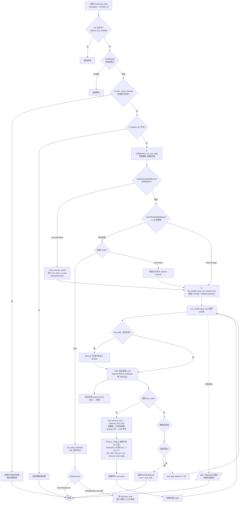
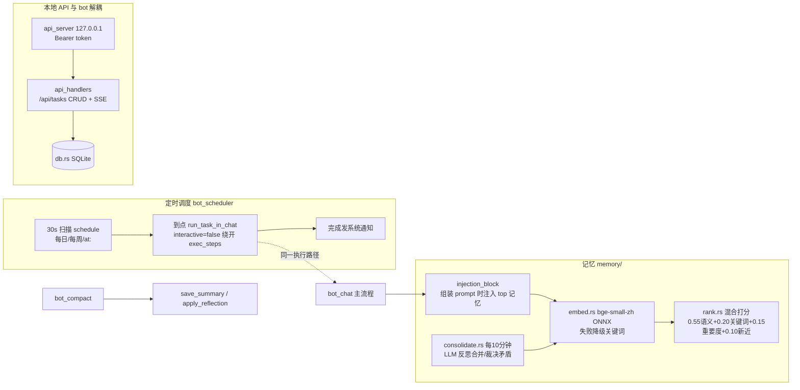
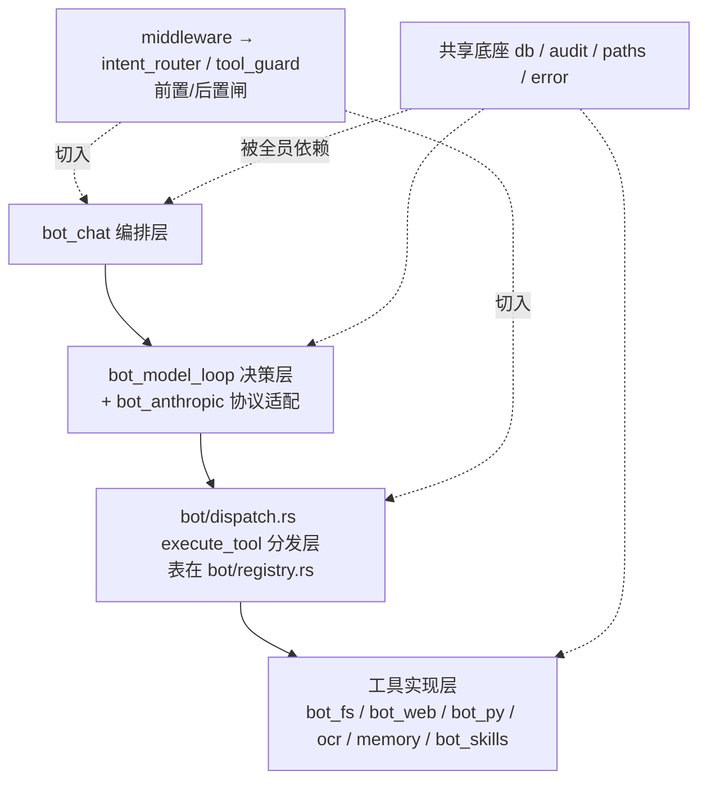

# wmessage Rust Bot 架构说明

> 项目形态：Tauri 2 桌面应用（任务看板 + AI 助手）。单 crate（`src-tauri/`，lib 名 `wmessage_lib`），`main.rs` 仅 6 行调 `wmessage_lib::run()`。Rust 源码共 52 个文件、约 3.8 万行，全部在 `src-tauri/src/`。`src-tauri/vendor/tiny_http` 是 vendored 补丁依赖，非业务代码。

## 1. 文件结构 + 职责

```
src-tauri/src/
├── main.rs (6行)        入口，调 wmessage_lib::run()
├── lib.rs (867)         模块总表、Tauri setup、invoke_handler 注册、托盘/快捷键、退出清理
├── app_state.rs (255)   运行期全局状态单一入口 `AppState`（lib.rs setup `app.manage` 注入）：
│                        8 张执行期表 + 「全局状态总表」文档；详见 §2.1
├── consts.rs            前后端共享常量（app_consts 命令）
├── error.rs             CommandError 结构化错误（code=CommandErrorCode 枚举/message/recoverable），全命令统一
├── paths.rs             数据目录解析 + 便携模式判定
├── audit.rs             审计事件写 bot.log（audit_event! 宏、write_event、error_kv 带 code）
├── mutation.rs          任务变更来源枚举 MutationOrigin（Bot/Api/Widget…），tasks-updated 事件分流
│
│─ 数据层
├── db.rs (2693)         SQLite（wmessage.db）：Task/Subtask/TaskFile、会话与聊天记录、workspace、
│                        bind_files、导入导出、data_dir()/gen_dir()（AI_Gen_Files）
├── migration.rs         归档任务绑定文件按 cleanup-rules.json 规则迁移清理
├── task_out.rs          对外 TaskOut（Task flatten + status），api/api_handlers 共享
│
│─ 本地 HTTP API（127.0.0.1 微服务，与 bot 解耦，只操作任务数据）
├── api.rs               trait TaskStore + MemStore(测试) + TauriStore(生产)
├── api_server.rs        HTTP server 生命周期、端口绑定、EventHub（SSE 中枢）
├── api_auth.rs          Bearer token（runtime/flags/api-token.txt）、开关持久化（runtime/flags/api-enabled.flag）
├── api_handlers.rs      REST /api/tasks CRUD + SSE + api_start/stop 等命令
│
│─ Bot 核心（编排 → 决策 → 工具分发）
├── bot_chat.rs (1958)   入口编排：bot_chat / bot_compact / bot_execute_task 命令；五步主流程；
│                        SYSTEM_PROMPT/EXECUTE/SUMMARY/REFLECTION prompt 常量；
│                        ChatMsg/TaskRef/BotChatResult/TaskExecOrigin；多模态图片组装；ChatGuard 防重入
├── bot_model_loop.rs (1711) LLM 流式调用+工具循环：run_model_loop(薄壳装配)/run_model_loop_core(可注入 mock)；
│                        SSE 解析、思考块拆分；单轮 Function 熔断；LlmHttp / ModelLoopDeps 依赖注入
│                        （TOOLS schema 已移出，见 bot/registry.rs）
├── bot.rs (116)         门面：跨模块 re-export（BotChatResult/TaskRef/model_loop/StopGuard/AuditLevel/db::*）
│                        + 子模块声明；旧 `crate::bot::<item>` 路径 1:1 保持
├── bot/registry.rs (716)  **工具单源真相（阶段 2）**：29 个 schema 常量 + `TOOLS_TABLE`
│                        （name/schema/mutating/call）→ TOOLS JSON（tools_json:514）/
│                        MUTATING_TOOLS（mutating_tools:529）/ dispatch 查表三处全派生
├── bot/dispatch.rs (237)  工具调度核心 execute_tool / execute_tool_impl：**TOOLS_TABLE 查表**（非 match）+
│                        pre_execute 洋葱入口 + skill_on_step 钩子 + tool.return 结构化审计
├── bot/config.rs (1620)   BotConfig/ApiProvider/PermMode/KeySlot（bot-config.json，key 走系统 keyring）；
│                        bot_get_config/bot_set_config；audit_log
├── bot/tools.rs (1589)    28 个 tool_* 实现（任务卡 CRUD / 子任务 / 文档生成 / 联网 / 时间 / 记忆转发）
├── bot_anthropic.rs     Anthropic 协议适配（纯函数）：OpenAI ↔ /v1/messages 双向转换、auth 头、prompt caching
├── bot_plan.rs          PREVR 动态规划：复杂任务先生成计划注入 prompt，失败 Replan（≤2 次）
├── bot_scheduler.rs     定时任务卡调度：30s 扫描 schedule（每日/每周/at:），到点走 run_task_in_chat 自动执行；
│                        SchedGuard 防重入；完成发系统通知
├── bot_slash.rs         StopGuard/StopRegistry（/stop 按执行实例隔离；注册表已迁 app_state::AppState，
│                        见 §2.1）、危险操作确认弹窗、机器人总开关
├── exec_steps.rs        任务卡逐步执行模式：多子任务逐个做、用户确认「继续/重做/停」
├── bot_artifacts.rs     产物登记：link_file_to_task → 收尾按 TaskExecOrigin 分流 →
│                        emit artifact-batch-ready → 前端勾选 → confirm_artifact_batch 落库
│
│─ Bot 工具实现（被 bot.rs 分发调用）
├── bot_fs.rs            只读文件工具 read_text_file/grep_files/list_files；
│                        路径白名单 + perm_mode(strict/ask/yolo) 授权闸
├── bot_web.rs           web_search（Bing）+ fetch_url（HTML→文本、GBK、SSRF 防护、钉 IP）
├── bot_py.rs (3682)     Python 子进程执行：runtime/flags/py-enabled.flag 开关、独立临时目录、超时/内存/CPU 限额
│                        （rlimit / Job Object）、固定脚本模板（extract/make_docx/xlsx）、自由脚本 run_python
├── ocr.rs               ocr_image：macOS Vision / Windows PP-OCRv6 ONNX；纯本地不上网
│
│─ 技能系统 bot_skills/（技能 = 数据目录 skills/<name>/SKILL.md，YAML frontmatter）
├── bot_skills/mod.rs            门面：全量 re-export 子模块
├── bot_skills/parse.rs          SKILL.md frontmatter/正文解析 → SkillMeta（mode/intents/steps）
├── bot_skills/state.rs          SkillRun 运行实例 + 状态机
│                                （Loaded/Running/Paused/Finished/Failed/Terminated）、
│                                SKILL_RUNS 表（已迁 app_state::AppState，访问器需 AppHandle）
├── bot_skills/runtime.rs        生命周期：start_skill 预审/启动、暂停/确认/推进、skill_finish 收尾
├── bot_skills/scheduler.rs      DSL 步骤调度器 run_skill_scheduler + DslOutcome
│                                （Done/AwaitUser/FailedButRecoverable → LLM 兜底）
├── bot_skills/vars.rs           步骤变量替换（${stepN.field} / ${prev…} 嵌套路径）
├── bot_skills/manage.rs         技能安装/列表/删除，路由表重建触发点
├── bot_skills/files.rs          open_file_path/delete_bound_file 路径白名单校验（防 XSS→RCE）
│
│─ 路由/中间件
├── middleware.rs        trait Middleware + MiddlewareRegistry（Koa 洋葱，短路求值）；
│                        内置 3 个：ChatExecute / IntentRouter / AtomicGuard；helper run_pre_step / run_pre_execute
├── intent_router.rs     前置意图路由 RouteAction（Skill/ExecuteTasks/PassThrough）；
│                        L1 正则硬锁（技能 frontmatter intents 驱动，LLM 不参与选 Skill）
├── tool_guard.rs        原子工具黑名单后置拦截（现黑名单已清空，留壳）
│
└─ 记忆系统 memory/（v2，语义嵌入）
├── memory/mod.rs            门面：injection_block 聊天注入记忆块、save_summary/apply_reflection、
│                            工具 tool_remember_fact/recall_facts/record_lesson
├── memory/store.rs          mem_items 表 CRUD、500 条上限、余弦语义去重（合并/提示）
├── memory/embed.rs          bge-small-zh-v1.5 ONNX 本地嵌入（OnceCell 懒加载，失败全局降级关键词模式）
├── memory/rank.rs           混合打分 0.55 语义 + 0.20 关键词 + 0.15 重要度 + 0.10 新近度
├── memory/consolidate.rs    定时记忆整理：LLM 反思合并/裁决矛盾，10 分钟扫一次
└── memory/tests.rs + memory/consolidate/tests.rs   记忆单测（假向量，不依赖 ONNX）
```

## 2. 关键类型 / trait 位置

| 类型 | 位置 |
|---|---|
| `Middleware` trait / `MiddlewareRegistry` / 3 个内置中间件 | middleware.rs:27 / :39 / :235 / :252 / :269 |
| `RouteAction` / `IntentRule` | intent_router.rs:23 / :100 |
| `TaskStore` trait / `MemStore` / `TauriStore` | api.rs:30 / :48 / :95 |
| `Task` / `Subtask` / `TaskFile` / `BotSession` | db.rs:32 / :13 / :22 / :544 |
| `CommandError` / `CommandErrorCode` / `CommandResult` | error.rs:151 / :36 |
| `ChatMsg` / `TaskRef` / `BotChatResult` / `TaskExecOrigin` | bot_chat.rs:35 / :458 / :466 / :1151 |
| `BotConfig` / `ApiProvider` / `PermMode` / `KeySlot` | bot/config.rs:63 / :203 / :331 / :28 |
| `LlmHttp` / `ModelLoopDeps` / `ParsedChunk` | bot_model_loop.rs:363 / :380 / :146 |
| `SkillRun` / `SkillState` | bot_skills/state.rs |
| `SkillMeta` | bot_skills/parse.rs |
| `DslOutcome` | bot_skills/scheduler.rs |
| `MemItem` | memory/store.rs |
| `StopGuard` | bot_slash.rs（注册表 `StopMap` 见 app_state.rs） |
| 确认弹窗 `ConfirmMap` | app_state.rs（`confirms(app)` 访问器） |
| `AppState` / `TOOLS_TABLE` / `ToolDef` | app_state.rs:113 / bot/registry.rs:335 / :36 |

### 2.1 运行期全局状态（阶段 3 收口，2026-09-13）

单一入口 **`app_state.rs`**：`AppState` 由 `lib.rs` setup `app.manage(AppState::default())` 注入，
各模块用 `try_state` 取值（缺失则退回进程级兜底实例，语义不变）。已收口 **8 张执行期表**：

| 字段 | 原位置 | 持有者 / 清理 |
|---|---|---|
| `skill_runs` | bot_skills/state.rs | 状态机 + `skill_terminate_all` / `clear_terminal_skill_runs` |
| `stop_registry` | bot_slash.rs | `StopGuard::drop`（Arc 句柄） |
| `confirm_requests` | bot_slash.rs | 前端应答 / 60s 超时 |
| `chat_running` | bot_chat.rs | `ChatGuard::drop`（Arc 句柄） |
| `exec_running` | bot_chat.rs | `ExecGuard::drop`（Arc 句柄） |
| `sched_running` | bot_scheduler.rs | `SchedGuard::drop`（Arc 句柄） |
| `pending` | exec_steps.rs | 用户应答 / 超时 |
| `artifact_registry` | bot_artifacts.rs | 流程收尾 clear |

刻意**留档不收口**：`NEXT_STOP_ID`（id 发号器，进程级）、`SESSION_ORIGINS`（session 元数据，
「写一次/读一处/随 session 消亡」，理由与三条测量结论见 `app_state.rs` 总表与 `tool_guard.rs:45`）、
`ROUTES` / API 专属 4 项 / 不可变缓存（理由见 `app_state.rs` 模块头）。
测试隔离：相关用例各自 `manage` 独立实例；两把测试串行锁（`SKILL_RUNS_TEST_LOCK` / `STOP_TEST_LOCK`）
已随迁移撤除。

## 3. 主调用链（收到消息 → 回复）

```
前端 invoke bot_chat(messages, session_id)                [bot_chat.rs]
 → require_bot_enabled + ChatGuard 会话防重入
 → ① exec_steps::resume（有挂起子任务则本条是执行应答，优先返回）
 → ② bot::read_bypass_llm_switch（旧链路降级开关）
 → ③ middleware::run_pre_step（洋葱短路）                [middleware.rs]
     ChatExecuteMiddleware → RouteAction::ExecuteTasks → chat_execute_tasks
         （每卡走 run_task_in_chat → run_model_loop，50 轮工具循环）
     IntentRouterMiddleware → intent_router 正则命中 → bot_skills::start_skill
         ├─ mode=auto → run_skill_scheduler（DSL 逐步执行，
         │   FailedButRecoverable 时带 recovery_hint 落入 ⑤ 让 LLM 兜底）
         └─ mode=interactive → 技能正文拼进 system prompt，继续 ⑤
 → ⑤ bot_model_loop::run_model_loop                      [bot_model_loop.rs]
     薄壳装配 LlmHttp（bot_get_config + keyring key + ApiProvider）+ ModelLoopDeps
     → run_model_loop_core 循环：
         SSE 流式请求（OpenAI，或经 bot_anthropic 转 Anthropic /v1/messages）
         流式片段 emit bot-chat-delta 事件给前端
         模型返回 tool_calls → bot::execute_tool_traced → execute_tool_impl   [bot/dispatch.rs]
             （turn + tool_call_id 随调用下传：tool.call / tool.return / 早退事件都带
               session_id / turn / tool_call_id，可按轮或按 id 整轮回放）
             前置 middleware::run_pre_execute（原子黑名单已清空，拦截改由工具内部按
                 session 上下文判：is_task_execution_flow / is_skill_active）+ skill_on_step 钩子
             **TOOLS_TABLE 查表**分发 29 个工具（bot/registry.rs 单一来源）：
                 bot/tools.rs 内部 tool_* / bot_fs / bot_web / bot_py / ocr / memory / bot_skills::use_skill
             后置结构化审计 tool.return + skill_on_step_post
         工具结果回灌 msgs 续聊，直到无 tool_calls 或熔断（MAX_FUNCTION_CALLS_PER_TURN）
     bot_plan：复杂任务前置 Planner 注入计划；连续失败触发 Replan
     技能状态：核心只**读**「活动技能快照」（deps.active_skill_run 注入回调），
               收尾/入口清理等写操作留在核心之外（见 §2.1）
 → 记忆：组装 prompt 时 memory::injection_block 注入 top 记忆；
   compact 时 memory::save_summary / apply_reflection
 → 返回 BotChatResult{text, task_refs}
```

旁路入口：

- `bot_scheduler::start_scheduler`：30s 扫定时任务 → 同一 `run_task_in_chat` 路径（interactive=false，绕开 exec_steps）
- `bot_slash::bot_stop`：置位 StopGuard 中断在途循环
- 本地 HTTP API（api_* 四件套）与 bot 解耦，只操作任务数据

## 4. 模块依赖主干

```
bot_chat(编排) → bot_model_loop(决策) → bot::execute_tool(分发；表在 bot/registry.rs)
    → bot/tools.rs 内部 tool_* / bot_fs / bot_web / bot_py / ocr / memory / bot_skills(实现)
middleware → intent_router / tool_guard   提供前置/后置闸
bot_anthropic  只被 bot_model_loop 边界调用
app_state  运行期表容器（lib.rs 注入；各层 try_state 取）
db / audit / paths / error   全员共享底座
```

## 5. 配置 / prompt / 资源文件

- **运行时数据目录**（`paths::probe_log_dir` 判定，便携模式随 exe 走）：
  `wmessage.db`（SQLite）、`bot-config.json`（bot 配置，API key 已迁系统 keyring，自带 `schemaVersion`）、`bot.log`（审计）、`runtime/flags/`（`api-token.txt` / `api-enabled.flag` / `py-enabled.flag` / `bot-enabled.flag` 等运行期文件，根目录不再散落）、`profile.json` + `profile/`、`cleanup-rules.json`、`skills/<name>/SKILL.md`（用户技能）、`AI_Gen_Files/`（AI 产物唯一入口 `db::gen_dir`）
- **Prompt 不是独立文件**，是编译期常量：
  `SYSTEM_PROMPT`（bot_chat.rs:40）、`SUMMARY_SYSTEM_PROMPT`(:169)、`REFLECTION_SYSTEM_PROMPT`(:174)、`EXECUTE_SYSTEM_PROMPT`(:883)；工具 schema 单一来源 `TOOLS_TABLE`（bot/registry.rs:335）→ `tools_json()`（:514，编译期常量原文拼接）
- **打包资源**（tauri.conf.json resources）：
  `bge-small-zh-v1.5/`（嵌入模型 tokenizer+ONNX，项目根）、`pp-ocr-v6/`（Windows OCR 模型，scripts/fetch_ocr_models.sh 下载）、`src-tauri/icons/`、权限文件 `src-tauri/capabilities/default.json`（opener scope 收窄，有回归测试锁死）
- **设计文档**：`docs/`（BOT-MEMORY-V2-DESIGN.md、SKILL-RUNTIME.md、SKILL_DSL.md、TASK-CHAT-EXECUTION-DESIGN.md、ARCH-REFACTOR-PLAN.md 及多份审计报告）
- **Rust 侧测试**：`src-tauri/tests/`（llm_integration、task_chat_exec、mock_llm 等，走 `run_model_loop_core` 可注入路径）

## 6. Agent 运行步骤及逻辑图（Mermaid）

### 6.1 主流程（bot_chat 五步）



### 6.2 记忆与调度旁路



### 6.3 分层依赖


