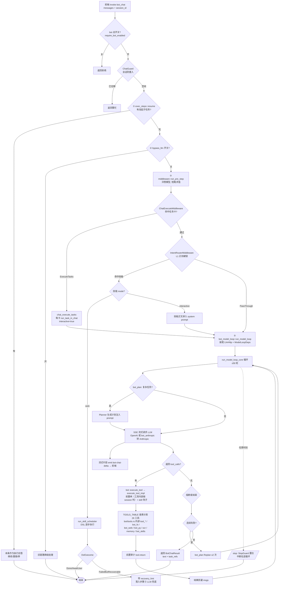
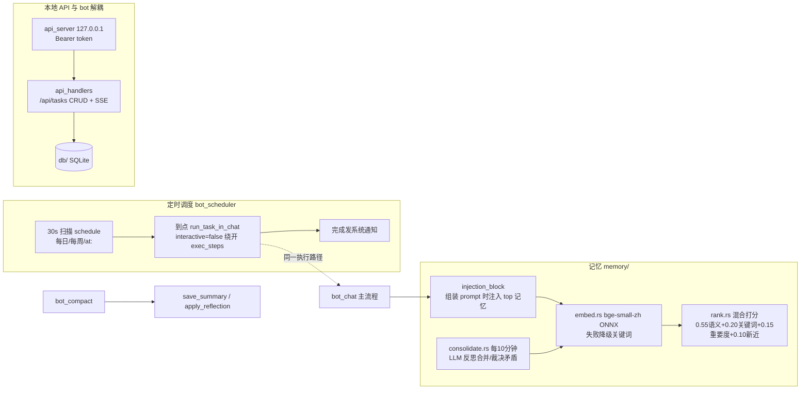
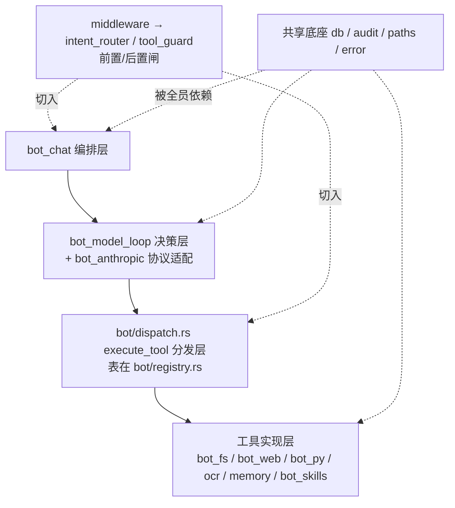

# wmessage Rust Bot 架构说明

> 项目形态：Tauri 2 桌面应用（任务看板 + AI 助手）。单 crate（`src-tauri/`，lib 名 `wmessage_lib`），`main.rs` 仅 6 行调 `wmessage_lib::run()`。Rust 源码共 52 个文件、约 3.8 万行，全部在 `src-tauri/src/`。`src-tauri/vendor/tiny_http` 是 vendored 补丁依赖，非业务代码。

## 1. 文件结构 + 职责

```
src-tauri/src/
├── main.rs (6行)        入口，调 wmessage_lib::run()
├── lib.rs (867)         模块总表、Tauri setup、invoke_handler 注册、托盘/快捷键、退出清理
├── app_state.rs (255)   运行期全局状态单一入口 `AppState`（lib.rs setup `app.manage` 注入）：
│                        8 张执行期表 + 「全局状态总表」文档；详见 §2.1
│                        （原 consts.rs 已并入 app_consts 命令、本节不列）
├── error.rs             CommandError 结构化错误（code=CommandErrorCode 枚举/message/recoverable），全命令统一
├── paths.rs             数据目录解析 + 便携模式判定
├── audit.rs             审计事件写 bot.log（audit_event! 宏、write_event、error_kv 带 code）
├── profile.rs           个人资料：用户/机器人 头像 + 姓名（profile.json + 头像拷进 profile/；读回 base64 data URL，
│                        原子写 + 损坏备份 + 5MB/扩展名校验）
├── mutation.rs          任务变更来源枚举 MutationOrigin（Bot/Api/Widget…），tasks-updated 事件分流
│
│─ 数据层
├── db/                  SQLite（wmessage.db）+ 迁移 + 产物 + 工作区（按表分文件）
│   ├── db/mod.rs      模块声明 + 公共 re-export
│   ├── tasks.rs         Task / Subtask / TaskFile
│   ├── bot_sessions.rs   BotSession / 会话归属
│   ├── bot_history.rs   会话聊天记录
│   ├── migrations.rs     数据库迁移（历史顶层 migration.rs 已并入）
│   ├── paths.rs          data_dir()/gen_dir()（AI_Gen_Files）
│   ├── skill_out.rs      技能产物输出
│   ├── subagents.rs      子 agent 编排持久化（SubagentRow / 六态状态机 transition_allowed /
│   │                     SubagentBudget 预算三硬顶；spawn 插 queued 行，check 幂等轮询）
│   ├── people.rs         成员注册表（多人任务汇总的归属人字典；people_list 命令 +
│   │                     upsert 最新名覆盖 + 占位兜底，见 docs/TASK-GRAPH-DESIGN-2026-10-05.md §1）
│   ├── trace.rs          执行痕迹三表 exec_traces/exec_spans/file_changes（Agent 透明化
│   │                     设计 §4.1）：append-only 观测面 + 钳制单源（SPAN_TEXT_MAX 16KB /
│   │                     MAX_DIFF_LINES）+ 保留期清理 retire_traces_before（僵尸 running 同删）
│   └── workspace.rs      workspace / bind_files
├── task_out.rs          对外 TaskOut（Task flatten + status），api/api_handlers 共享
├── trace_sink.rs        执行痕迹采集管道（Agent 透明化设计 §4.2）：dispatch 工具调用 →
│                        mpsc 后台攒批落库（writer 长连接 + DB_WRITE_LOCK）；trace 生命周期
│                        begin/end_trace（run_task_in_chat_with 首尾）+ TraceCapture 挂钩
├── task_autotag.rs      归档自动打标（一次性 LLM ≤3 标签回写 tags；守卫链幂等 +
│                        校验链截断不整包拒 + 失败静默审计，见任务图谱设计 §2）
├── tag_similar.rs       标签近义（embed 引擎逐标签向量 + 余弦 ≥0.78 对返回；
│                        进程级向量缓存 + 审计，图谱同义聚簇锚点用，任务图谱设计 §3）
│
│─ 模型元数据 meta/（原独立 Python 服务 model-meta-service 的内嵌版，127.0.0.1:8765 已退役）
├── meta/mod.rs          MetaProvider/MetaModel/MetaModelJoined + meta_provider/meta_model
│                        双表 CRUD（DDL 在 db/migrations.rs ensure_meta_tables，open_db 幂等建表）+
│                        8 个 meta_* 命令；user_custom 行永不被同步覆盖（ON CONFLICT WHERE 守卫）
└── meta/sync.rs         models.dev 同步：parse_models_dev 纯函数 + sync_models_dev
                         （shared_llm_client + 30s 超时；lib.rs setup 后台 spawn，失败仅审计不阻断）
│
│─ 本地 HTTP API（127.0.0.1 微服务，与 bot 解耦，只操作任务数据）
├── api.rs               trait TaskStore + MemStore(测试) + TauriStore(生产)
├── api_server.rs        HTTP server 生命周期、端口绑定、EventHub（SSE 中枢）
├── api_auth.rs          Bearer token（runtime/flags/api-token.txt）、开关持久化（runtime/flags/api-enabled.flag）
├── api_handlers/        REST /api/tasks CRUD + SSE + api_start/stop 等命令
│   ├── api_handlers/mod.rs  模块声明 + 路由分发
│   ├── handlers.rs      HTTP 路由层
│   ├── api_handlers/commands.rs  tauri 命令层
│   ├── body.rs          请求/响应模型
│   ├── sse.rs           SSE 事件流
│   ├── ratelimit.rs     限流
│   ├── util.rs          工具函数
│   ├── validate.rs      入参校验
│   └── api_handlers/types.rs    共享类型
│
│─ Bot 核心（编排 → 决策 → 工具分发）
├── bot_chat.rs          入口编排：bot_chat / bot_compact / bot_execute_task 命令；五步主流程；
│                        ChatMsg/TaskRef/BotChatResult/TaskExecOrigin；多模态图片组装；ChatGuard 防重入
│                        （prompt 常量已移出，见 prompts/）
│─ 提示词 prompts/（AI 应用的业务逻辑，与代码同等对待；统一从 `crate::prompts::NAME` 取）
├── prompts/mod.rs        模块声明 + `crate::prompts::NAME` 统一出口 + prompt 清单锁测试
│   ├── prompts/subagent.rs 子 Agent 编排提示词（设计 §8）：主 agent 派发职责段/
│   │                     子 agent 通用段/research·coder·general 三 profile/收尾
│   │                     JSON schema 提示；镜像资产 docs/prompts/subagent/
│   prompts/system.rs       SYSTEM_PROMPT（主聊天规则底座 + 安全红线）
│   prompts/summary.rs      SUMMARY_SYSTEM_PROMPT（截断即摘要 ≤200 字）/ COMPACT_SYSTEM_PROMPT（/compact ≤300 字）
│   prompts/reflection.rs   REFLECTION_SYSTEM_PROMPT（多摘要 → 阶段总结）
│   prompts/execute.rs      EXECUTE_SYSTEM_PROMPT（任务卡执行）/ STEPWISE_ADDENDUM（逐步执行附加段）
│   prompts/planner.rs      PLANNER_PROMPT / REPLANNER_PROMPT（bot_plan 动态计划，只输出 JSON）
│   prompts/consolidate.rs  CONSOLIDATE_PROMPT（记忆整理，只输出 JSON ops）
│   prompts/extract.rs      EXTRACT_PROMPT（U16 会话收尾记忆抽取，只输出 JSON 数组）
├── bot_model_loop.rs (1711) LLM 流式调用+工具循环：run_model_loop(薄壳装配)/run_model_loop_core(可注入 mock)；
│                        SSE 解析、思考块拆分；单轮 Function 熔断；LlmHttp / ModelLoopDeps 依赖注入
│                        （TOOLS schema 已移出，见 bot/registry.rs）
├── bot.rs (116)         门面：跨模块 re-export（BotChatResult/TaskRef/model_loop/StopGuard/AuditLevel/db::*）
│                        + 子模块声明；旧 `crate::bot::<item>` 路径 1:1 保持
├── bot/registry.rs (716)  **工具单源真相（阶段 2）**：33 个 schema 常量 + `TOOLS_TABLE`
│                        （name/schema/mutating/call，33 工具=31 主可见+2 子 agent 专属）→
│                        TOOLS JSON（tools_json）/ MUTATING_TOOLS / dispatch 查表三处全派生
├── bot/dispatch.rs (237)  工具调度核心 execute_tool / execute_tool_impl：**TOOLS_TABLE 查表**（非 match）+
│                        pre_execute 洋葱入口 + skill_on_step 钩子 + tool.return 结构化审计
├── bot/mcp/             外部 MCP 服务器接入（stdio/HTTP，设置页 McpPanel 管理）：
│   ├── bot/mcp/mod.rs   模块声明
│   ├── bot/mcp/config.rs        McpServerConfig/校验（stdio 启动器白名单、URL 公网闸、
│   │                            normalize/timeout 钳制）+ 工具命名 mcp_tool_name/tool_prefix
│   ├── bot/mcp/manager.rs       McpManager（OnceLock 单例）：连接槽 ensure_connected/call_tool、
│   │                            指纹懒重连、stderr 环形缓冲、spawn 白名单字面量构造
│   ├── bot/mcp/mount.rs         挂载层：连接快照 → 工具 schema 段（撞名消歧/条数/schema 体积
│   │                            上限）+ dispatch miss 反查 execute_mcp_tool（带超时/结果整形）
│   ├── bot/mcp/secrets.rs       B4-6 机密存储：env/headers blob 走 keyring `mcp:<id>` 条目
│   │                            （Linux 降级单文件 0600）+ 进程内缓存 + load_config 水合 +
│   │                            迁移判据；配置永不明文（skip_serializing 收口）
│   └── bot/mcp/commands.rs      设置页 tauri 命令：mcp_server_save/delete/toggle、
│                                mcp_status、mcp_server_tools（写路径 CONFIG_WRITE_LOCK 全程持锁）
├── bot/config/          BotConfig/ApiProvider/PermMode/KeySlot（bot-config.json，key 走系统 keyring）；
│   ├── bot/config/mod.rs  模块声明
│   ├── bot/config/schema.rs        bot-config.json schemaVersion 迁移 + 双协议派生
│   │                               （derive_legacy_fields_from_active / active_model_entry
│   │                               / effective_inference 条目级推理参数解析）+ resolve_max_tokens
│   ├── bot/config/types.rs  ApiProvider / PermMode / KeySlot
│   ├── bot/config/io.rs    配置读写 + 默认值 + read_memory_control（U15 记忆开关轻量读取）
│   ├── keyring.rs        API key 走系统 keyring
│   ├── bot/config/commands.rs  bot_get_config / bot_set_config
│   ├── bot/reasoning.rs  推理强度线上参数映射（RE-1）：EffortLevel 档位 →
│   │                     按模型族/协议的 ReasoningWire（OpenAI effort/GLM thinking/
│   │                     Anthropic budget），resolve 装配 + describe 审计展示
│   └── audit.rs         audit_log
├── bot/tools.rs (1589)    28 个 tool_* 实现（任务卡 CRUD / 子任务 / 文档生成 / 联网 / 时间 / 记忆转发）
├── bot_anthropic.rs     Anthropic 协议适配（纯函数）：OpenAI ↔ /v1/messages 双向转换、auth 头、prompt caching
├── bot_plan.rs          PREVR 动态规划：复杂任务先生成计划注入 prompt，失败 Replan（≤2 次）
├── bot_scheduler.rs     定时任务卡调度：30s 扫描 schedule（每日/每周/at:），到点走 run_task_in_chat 自动执行；
│                        SchedGuard 防重入；完成发系统通知
├── due_notify.rs        任务卡截止系统通知：30s 扫描活跃任务（仿 bot_scheduler），截止前 1h 一条、
│                        截止时刻一条（超 24h 老任务不补发，防升级/重启后轰炸）；通知失败只记日志
├── bot_slash.rs         StopGuard/StopRegistry（/stop 按执行实例隔离；注册表已迁 app_state::AppState，
│                        见 §2.1）、危险操作确认弹窗、机器人总开关
├── exec_steps.rs        任务卡逐步执行模式：多子任务逐个做、用户确认「继续/重做/停」
├── bot_orchestrator.rs  子 Agent 编排器（方案 B，SUBA 设计 2026-09-27）：受管子 agent 的
│                        spawn/check/cancel 生命周期状态机 + 子卡（🧩）创建 + acceptance
│                        双写 + 预算钳制；与 bot_execute_task（单发子 agent）入口/存储/事件
│                        各自独立；LLM 工具暴露/runner（SUBA-2）与预算强制/并发排队（SUBA-3）
│                        按设计 §11 分批接入
├── bot_artifacts.rs     产物登记：link_file_to_task → 收尾按 TaskExecOrigin 分流 →
│                        落「通知中心」artifact_bind 消息（原 artifact-batch-ready 挂件弹窗已下线）→
│                        通知页勾选 → confirm_artifact_batch 落库 + notif_resolve_artifact 回写
├── notifications.rs (465) Agent 通知中心：notifications 表持久化消息（INSERT OR IGNORE 幂等，
│                        memory_proposal / evolution_proposal / artifact_bind 三类）+
│                        notifications_list/pending_count/resolve/clear_done 四命令 +
│                        notifications-changed 广播；双向同步（mem approve/reject、evo 面板、
│                        confirm_artifact_batch 尾部回写消息状态）
├── bot_desktop.rs (295) 电脑辅助 Tier1（N4，只「看」与「打开」）：reveal_path（opener 定位，
│                        白名单闸）/ open_url（公网闸 ensure_public_http_url）/
│                        clipboard_write（官方 clipboard-manager v2）/ screenshot
│                        （macOS screencapture -x / Windows PowerShell，落 AI_Gen_Files）；
│                        原生鼠标键盘 Computer Use 不做（spec N4 出界说明）
├── bot_skills/recommend.rs 语义化技能推荐（N7-②）：技能描述 embed（bge-small-zh 复用
│                        memory/embed）+ 余弦排序截断 top5，embed 不可用降级全清单；
│                        只影响 SkillCatalog 呈现顺序，不接管 IntentRule 路由
│
│─ Bot 工具实现（被 bot.rs 分发调用）
├── bot_fs.rs            只读工具 read_text_file/grep_files/list_files + 文件编辑
│                        edit_file/write_file（N6，Aider 式三级匹配：精确→空白容错→
│                        reflection；写白名单≠读白名单：可写根=AI_Gen_Files+任务卡
│                        绑定文件夹+allowedDirs；白名单外 perm_mode 三分支/覆盖确认）；
│                        路径白名单 + perm_mode(strict/ask/yolo) 授权闸
├── bot_web.rs           web_search（Bing）+ fetch_url（HTML→文本、GBK、SSRF 防护、钉 IP）
├── bot_py.rs (3682)     Python 子进程执行：runtime/flags/py-enabled.flag 开关、独立临时目录、超时/内存/CPU 限额
│                        （rlimit / Job Object）、固定脚本模板（extract/make_docx/xlsx）、自由脚本 run_python
├── ocr.rs               ocr_image：macOS Vision / Windows PP-OCRv6 ONNX；纯本地不上网
│
│─ 技能系统 bot_skills/（技能 = 数据目录 skills/<name>/SKILL.md，YAML frontmatter）
├── bot_skills/mod.rs            门面：全量 re-export 子模块
├── bot_skills/parse.rs          SKILL.md frontmatter/正文解析 → SkillMeta（mode/intents/steps）
├── bot_skills/state.rs          SkillRun 运行实例 + 状态机
│                                （Loaded/Running/Paused/Finished/Failed/Terminated）、
│                                SKILL_RUNS 表（已迁 app_state::AppState，访问器需 AppHandle）
├── bot_skills/runtime.rs        生命周期：start_skill 预审/启动、暂停/确认/推进、skill_finish 收尾
├── bot_skills/scheduler.rs      DSL 步骤调度器 run_skill_scheduler + DslOutcome
│                                （Done/AwaitUser/FailedButRecoverable → LLM 兜底）
├── bot_skills/vars.rs           步骤变量替换（${stepN.field} / ${prev…} 嵌套路径）
├── bot_skills/manage.rs         技能安装/列表/删除，路由表重建触发点
├── bot_skills/files.rs          open_file_path/delete_bound_file 路径白名单校验（防 XSS→RCE）
│
│─ 路由/中间件
├── middleware.rs        trait Middleware + MiddlewareRegistry（Koa 洋葱，短路求值）；
│                        内置 3 个：ChatExecute / IntentRouter / AtomicGuard；helper run_pre_step / run_pre_execute
├── intent_router.rs     前置意图路由 RouteAction（Skill/ExecuteTasks/PassThrough）；
│                        L1 正则硬锁（技能 frontmatter intents 驱动，LLM 不参与选 Skill）
├── tool_guard.rs        原子工具黑名单后置拦截（现黑名单已清空，留壳）
│
└─ 记忆系统 memory/（v2，语义嵌入）
├── memory/mod.rs            门面：injection_block 聊天注入记忆块（U15 注入总闸）、
│                            save_summary/apply_reflection、工具 tool_remember_fact/
│                            recall_facts/record_lesson（U15 主动记忆门禁）、MemoryControl
├── memory/store.rs          mem_items 表 CRUD、500 条上限、余弦语义去重（合并/提示）
├── memory/embed.rs          bge-small-zh-v1.5 ONNX 本地嵌入（OnceCell 懒加载，失败全局降级关键词模式）
├── memory/rank.rs           混合打分 0.55 语义 + 0.20 关键词 + 0.15 重要度 + 0.10 新近度
├── memory/consolidate.rs    定时记忆整理：LLM 反思合并/裁决矛盾，10 分钟扫一次
├── memory/panel.rs          设置页记忆库命令：mem_list（混合检索纯读不刷访问计数）/
│                            mem_update（content 变更重算嵌入）/ mem_delete / mem_stats
│                            （统计 + 嵌入引擎状态），MemItemView 不含向量本体；
│                            mem_export/mem_import（JSON 带向量，导入走语义去重只增不删）
├── memory/extract.rs        U16 自动记忆抽取：bot_chat 收尾触发（fire-and-forget，仅交互
│                            会话 + 30 分钟限频）→ LLM 抽取 → parse_extract 容错解析 →
│                            auto 直接入库 / confirm 进 mem_pending 待确认队列
│                            （mem_pending_list/approve/reject，approve 走语义去重入库）；
│                            U19 写入时冲突裁决（两段式）：相似候选（cos≥dedupHint，
│                            只查抽取域 kind）→ LLM 逐条裁决 new/update/skip——改口
│                            update_by_id 更新原条目不堆积，坏输出回退全 new
└── memory/tests.rs + memory/consolidate/tests.rs   记忆单测（假向量，不依赖 ONNX）
```

## 2. 关键类型 / trait 位置

| 类型 | 位置 |
|---|---|
| `Middleware` trait / `MiddlewareRegistry` / 3 个内置中间件 | middleware.rs:27 / :39 / :235 / :252 / :269 |
| `RouteAction` / `IntentRule` | intent_router.rs:23 / :100 |
| `TaskStore` trait / `MemStore` / `TauriStore` | api.rs:30 / :48 / :95 |
| `Task` / `Subtask` / `TaskFile` / `BotSession` | db.rs:32 / :13 / :22 / :544 |
| `CommandError` / `CommandErrorCode` / `CommandResult` | error.rs:151 / :36 |
| `ChatMsg` / `TaskRef` / `BotChatResult` / `TaskExecOrigin` | bot_chat.rs:35 / :458 / :466 / :1151 |
| `BotConfig` / `ApiProvider` / `PermMode` / `KeySlot` | bot/config.rs:63 / :203 / :331 / :28 |
| `LlmHttp` / `ModelLoopDeps` / `ParsedChunk` | bot_model_loop.rs:363 / :380 / :146 |
| `SkillRun` / `SkillState` | bot_skills/state.rs |
| `SkillMeta` | bot_skills/parse.rs |
| `DslOutcome` | bot_skills/scheduler.rs |
| `MemItem` | memory/store.rs |
| `MetaProvider` / `MetaModel` / `MetaModelJoined` / `MetaSyncResult` | meta/mod.rs |
| `StopGuard` | bot_slash.rs（注册表 `StopMap` 见 app_state.rs） |
| 确认弹窗 `ConfirmMap` | app_state.rs（`confirms(app)` 访问器） |
| `AppState` / `TOOLS_TABLE` / `ToolDef` | app_state.rs:113 / bot/registry.rs:335 / :36 |

### 2.1 运行期全局状态（阶段 3 收口，2026-09-13）

单一入口 **`app_state.rs`**：`AppState` 由 `lib.rs` setup `app.manage(AppState::default())` 注入，
各模块用 `try_state` 取值（缺失则退回进程级兜底实例，语义不变）。已收口 **8 张执行期表**：

| 字段 | 原位置 | 持有者 / 清理 |
|---|---|---|
| `skill_runs` | bot_skills/state.rs | 状态机 + `skill_terminate_all` / `clear_terminal_skill_runs` |
| `stop_registry` | bot_slash.rs | `StopGuard::drop`（Arc 句柄） |
| `confirm_requests` | bot_slash.rs | 前端应答 / 60s 超时 |
| `chat_running` | bot_chat.rs | `ChatGuard::drop`（Arc 句柄） |
| `exec_running` | bot_chat.rs | `ExecGuard::drop`（Arc 句柄） |
| `sched_running` | bot_scheduler.rs | `SchedGuard::drop`（Arc 句柄） |
| `pending` | exec_steps.rs | 用户应答 / 超时 |
| `artifact_registry` | bot_artifacts.rs | 流程收尾 clear |

刻意**留档不收口**：`NEXT_STOP_ID`（id 发号器，进程级）、`SESSION_ORIGINS`（session 元数据，
「写一次/读一处/随 session 消亡」，理由与三条测量结论见 `app_state.rs` 总表与 `tool_guard.rs:45`）、
`ROUTES` / API 专属 4 项 / 不可变缓存（理由见 `app_state.rs` 模块头）。
测试隔离：相关用例各自 `manage` 独立实例；两把测试串行锁（`SKILL_RUNS_TEST_LOCK` / `STOP_TEST_LOCK`）
已随迁移撤除。

## 3. 主调用链（收到消息 → 回复）

```
前端 invoke bot_chat(messages, session_id)                [bot_chat.rs]
 → require_bot_enabled + ChatGuard 会话防重入
 → ① exec_steps::resume（有挂起子任务则本条是执行应答，优先返回）
 → ② bot::read_bypass_llm_switch（旧链路降级开关）
 → ③ middleware::run_pre_step（洋葱短路）                [middleware.rs]
     ChatExecuteMiddleware → RouteAction::ExecuteTasks → chat_execute_tasks
         （每卡走 run_task_in_chat → run_model_loop，50 轮工具循环）
     IntentRouterMiddleware → intent_router 正则命中 → bot_skills::start_skill
         ├─ mode=auto → run_skill_scheduler（DSL 逐步执行，
         │   FailedButRecoverable 时带 recovery_hint 落入 ⑤ 让 LLM 兜底）
         └─ mode=interactive → 技能正文拼进 system prompt，继续 ⑤
 → ⑤ bot_model_loop::run_model_loop                      [bot_model_loop.rs]
     薄壳装配 LlmHttp（bot_get_config + keyring key + ApiProvider）+ ModelLoopDeps
     → run_model_loop_core 循环：
         SSE 流式请求（OpenAI，或经 bot_anthropic 转 Anthropic /v1/messages）
         流式片段 emit bot-chat-delta 事件给前端
         模型返回 tool_calls → bot::execute_tool_traced → execute_tool_impl   [bot/dispatch.rs]
             （turn + tool_call_id 随调用下传：tool.call / tool.return / 早退事件都带
               session_id / turn / tool_call_id，可按轮或按 id 整轮回放）
             前置 middleware::run_pre_execute（原子黑名单已清空，拦截改由工具内部按
                 session 上下文判：is_task_execution_flow / is_skill_active）+ skill_on_step 钩子
             **TOOLS_TABLE 查表**分发 29 个工具（bot/registry.rs 单一来源）：
                 bot/tools.rs 内部 tool_* / bot_fs / bot_web / bot_py / ocr / memory / bot_skills::use_skill
             后置结构化审计 tool.return + skill_on_step_post
         工具结果回灌 msgs 续聊，直到无 tool_calls 或熔断（MAX_FUNCTION_CALLS_PER_REQUEST）
     bot_plan：复杂任务前置 Planner 注入计划；连续失败触发 Replan
     技能状态：核心只**读**「活动技能快照」（deps.active_skill_run 注入回调），
               收尾/入口清理等写操作留在核心之外（见 §2.1）
 → 记忆：组装 prompt 时 memory::injection_block 注入 top 记忆；
   compact 时 memory::save_summary / apply_reflection
 → 返回 BotChatResult{text, task_refs}
```

旁路入口：

- `bot_scheduler::start_scheduler`：30s 扫定时任务 → 同一 `run_task_in_chat` 路径（interactive=false，绕开 exec_steps）
- `bot_slash::bot_stop`：置位 StopGuard 中断在途循环
- 本地 HTTP API（api_* 四件套）与 bot 解耦，只操作任务数据

## 4. 模块依赖主干

```
bot_chat(编排) → bot_model_loop(决策) → bot::execute_tool(分发；表在 bot/registry.rs)
    → bot/tools.rs 内部 tool_* / bot_fs / bot_web / bot_py / ocr / memory / bot_skills(实现)
middleware → intent_router / tool_guard   提供前置/后置闸
bot_anthropic  只被 bot_model_loop 边界调用
app_state  运行期表容器（lib.rs 注入；各层 try_state 取）
db / audit / paths / error   全员共享底座
```

## 5. 配置 / prompt / 资源文件

- **运行时数据目录**（`paths::probe_log_dir` 判定，便携模式随 exe 走）：
  `wmessage.db`（SQLite）、`bot-config.json`（bot 配置，API key 已迁系统 keyring，自带 `schemaVersion`）、`bot.log`（审计）、`runtime/flags/`（`api-token.txt` / `api-enabled.flag` / `py-enabled.flag` / `bot-enabled.flag` 等运行期文件，根目录不再散落）、`profile.json` + `profile/`、`cleanup-rules.json`、`skills/<name>/SKILL.md`（用户技能）、`AI_Gen_Files/`（AI 产物唯一入口 `db::gen_dir`）
- **Prompt 集中在 `src-tauri/src/prompts/`**（`&'static str` 编译期常量，无 IO 无状态）：
  `system.rs`（`SYSTEM_PROMPT`）、`summary.rs`（`SUMMARY_SYSTEM_PROMPT` / `COMPACT_SYSTEM_PROMPT`）、
  `reflection.rs`、`execute.rs`（`EXECUTE_SYSTEM_PROMPT` / `STEPWISE_ADDENDUM`）、
  `planner.rs`（`PLANNER_PROMPT` / `REPLANNER_PROMPT`）、`consolidate.rs`；统一从
  `crate::prompts::NAME` 取。**不是** `.md` 资源文件（`.md` + `include_str!` 会引入真实换行 =
  改提示词字节内容，属需单独评估的改动；若将来要换实现，调用方路径不变）。
  工具 schema 单一来源 `TOOLS_TABLE`（bot/registry.rs:335）→ `tools_json()`（:514，编译期常量原文拼接）
- **打包资源**（tauri.conf.json resources）：
  `bge-small-zh-v1.5/`（嵌入模型 tokenizer+ONNX，项目根）、`pp-ocr-v6/`（Windows OCR 模型，scripts/fetch_ocr_models.sh 下载）、`src-tauri/icons/`、权限文件 `src-tauri/capabilities/default.json`（opener scope 收窄，有回归测试锁死）
- **设计文档**：`docs/`（BOT-MEMORY-V2-DESIGN.md、SKILL-RUNTIME.md、SKILL-DSL.md、TASK-CHAT-EXECUTION-DESIGN.md、ARCH-REFACTOR-PLAN.md 及多份审计报告）
- **Rust 侧测试**：`src-tauri/tests/`（llm_integration、task_chat_exec、mock_llm 等，走 `run_model_loop_core` 可注入路径）

## 6. Agent 运行步骤及逻辑图（Mermaid）

### 6.1 主流程（bot_chat 五步）


```mermaid
flowchart TD
    A[前端 invoke bot_chat<br/>messages + session_id] --> B{bot 总开关?<br/>require_bot_enabled}
    B -- 关 --> B1[返回拒绝]
    B -- 开 --> C{ChatGuard<br/>会话防重入}
    C -- 已在聊 --> C1[返回繁忙]
    C -- 空闲 --> D{① exec_steps::resume<br/>有挂起子任务?}
    D -- 有 --> D1[本条作为执行应答<br/>继续/重做/停] --> Z
    D -- 无 --> E{② bypass_llm 开关?}
    E -- 开 --> E1[旧链路降级处理] --> Z
    E -- 关 --> F[③ middleware::run_pre_step<br/>洋葱模型, 短路求值]

    F --> G{ChatExecuteMiddleware<br/>命中任务卡?}
    G -- ExecuteTasks --> G1[chat_execute_tasks<br/>每卡 run_task_in_chat<br/>interactive=true] --> L
    G -- 通过 --> H{IntentRouterMiddleware<br/>L1 正则硬锁}
    H -- 命中技能 --> I{技能 mode?}
    I -- auto --> J[run_skill_scheduler<br/>DSL 逐步执行]
    J --> J1{DslOutcome}
    J1 -- Done/AwaitUser --> Z
    J1 -- FailedButRecoverable --> K[带 recovery_hint<br/>落入步骤⑤ LLM 兜底]
    I -- interactive --> K2[技能正文拼入 system prompt] --> L
    H -- PassThrough --> L

    L[⑤ bot_model_loop::run_model_loop<br/>装配 LlmHttp + ModelLoopDeps] --> M[run_model_loop_core 循环<br/>≤50 轮]
    M --> N{bot_plan: 复杂任务?}
    N -- 是 --> N1[Planner 生成计划注入 prompt]
    N -- 否 --> O
    N1 --> O[SSE 流式请求 LLM<br/>OpenAI 或 bot_anthropic 转 Anthropic]
    O --> O1[流式片段 emit bot-chat-delta → 前端]
    O --> P{返回 tool_calls?}
    P -- 有 --> Q[bot::execute_tool → execute_tool_impl<br/>前置闸（工具内部按 session 判）+ skill 钩子]
    Q --> R[TOOLS_TABLE 查表分发 29 工具:<br/>bot/tools.rs 内部 tool_* / bot_fs /<br/>bot_web / bot_py / ocr / memory / bot_skills]
    R --> R1[后置审计 tool.return] --> R2[结果回灌 msgs] --> M
    P -- 无 --> S{熔断或结束}
    S --> T{连续失败?}
    T -- 是 --> T1[bot_plan Replan ≤2 次] --> M
    T -- 否 --> U[返回 BotChatResult<br/>text + task_refs]
    U --> Z([结束])

    M -.->|任意时刻| ST[/stop: StopGuard 置位<br/>中断在途循环/]
    ST --> Z
```

### 6.2 记忆与调度旁路


```mermaid
flowchart LR
    subgraph 记忆 memory/
        M1[injection_block<br/>组装 prompt 时注入 top 记忆] 
        M2[embed.rs bge-small-zh ONNX<br/>失败降级关键词]
        M3[rank.rs 混合打分<br/>0.55语义+0.20关键词+0.15重要度+0.10新近]
        M4[consolidate.rs 每10分钟<br/>LLM 反思合并/裁决矛盾]
        M1 --> M2 --> M3
        M4 --> M2
    end

    subgraph 定时调度 bot_scheduler
        S1[30s 扫描 schedule<br/>每日/每周/at:] --> S2[到点 run_task_in_chat<br/>interactive=false 绕开 exec_steps]
        S2 --> S3[完成发系统通知]
    end

    subgraph 本地 API 与 bot 解耦
        H1[api_server 127.0.0.1<br/>Bearer token] --> H2[api_handlers<br/>/api/tasks CRUD + SSE]
        H2 --> H3[(db/ SQLite)]
    end

    BC[bot_chat 主流程] --> M1
    BC2[bot_compact] --> M5[save_summary / apply_reflection]
    S2 -.同一执行路径.-> BC
```

### 6.3 分层依赖


```mermaid
flowchart TD
    编排[bot_chat 编排层] --> 决策[bot_model_loop 决策层<br/>+ bot_anthropic 协议适配]
    决策 --> 分发[bot/dispatch.rs execute_tool 分发层<br/>表在 bot/registry.rs]
    分发 --> 工具[工具实现层<br/>bot_fs / bot_web / bot_py / ocr / memory / bot_skills]
    闸[middleware → intent_router / tool_guard<br/>前置/后置闸] -.切入.-> 编排
    闸 -.切入.-> 分发
    底座[共享底座 db / audit / paths / error] -.被全员依赖.-> 编排
    底座 -.-> 决策
    底座 -.-> 工具
```

## 6.4 源文件清单（完整列表，由 `tests-audit/audit_module_map.py` 对拍）

`src-tauri/src/` 实际 136 个 `.rs` 文件（按模块分组）。本节由 `audit_module_map.py`
通过相对路径或文件名提及强制要求；任何新增模块请同步登记。

### 顶层
- `api.rs`
- `api_auth.rs`
- `api_server.rs`
- `app_state.rs`
- `audit.rs`
- `bot.rs`
- `bot_anthropic.rs`
- `bot_artifacts.rs`
- `bot_chat.rs`
- `bot_fs.rs`
- `bot_model_loop.rs`
- `bot_plan.rs`
- `bot_py.rs`
- `bot_scheduler.rs`
- `bot_slash.rs`
- `bot_web.rs`
- `due_notify.rs`
- `error.rs`
- `exec_steps.rs`
- `intent_router.rs`
- `lib.rs`
- `main.rs`
- `middleware.rs`
- `mutation.rs`
- `ocr.rs`
- `paths.rs`
- `profile.rs`
- `prompt_builder.rs`
- `task_autotag.rs`
- `tag_similar.rs`
- `task_out.rs`
- `trace_sink.rs`
- `tool_guard.rs`
- `workflow_decompose.rs`
- `workflow_runner.rs`

### `api_handlers/`
- `api_handlers/body.rs`
- `api_handlers/commands.rs`
- `api_handlers/handlers.rs`
- `api_handlers/mod.rs`
- `api_handlers/ratelimit.rs`
- `api_handlers/sse.rs`
- `api_handlers/types.rs`
- `api_handlers/util.rs`
- `api_handlers/validate.rs`

### `bin/`
- `bin/eval_run.rs`
- `bin/observe_run.rs`

### `bot/`
- `bot/config/audit.rs`
- `bot/config/commands.rs`
- `bot/config/io.rs`
- `bot/config/keyring.rs`
- `bot/config/mod.rs`
- `bot/config/schema.rs`
- `bot/config/types.rs`
- `bot/dispatch.rs`
- `bot/format.rs`
- `bot/registry.rs`
- `bot/tools.rs`

### `bot_skills/`
- `bot_skills/files.rs`
- `bot_skills/manage.rs`
- `bot_skills/mod.rs`
- `bot_skills/parse.rs`
- `bot_skills/runtime.rs`
- `bot_skills/scheduler.rs`
- `bot_skills/state.rs`
- `bot_skills/vars.rs`

### `db/`
- `db/bot_history.rs`
- `db/bot_sessions.rs`
- `db/migrations.rs`
- `db/mod.rs`
- `db/paths.rs`
- `db/people.rs`
- `db/skill_out.rs`
- `db/tasks.rs`
- `db/trace.rs`
- `db/workflow.rs`
- `db/workspace.rs`

### `eval/`
- `eval/case.rs`
- `eval/config.rs`
- `eval/feedback.rs`
- `eval/metrics.rs`
- `eval/mod.rs`
- `eval/runner.rs`
- `eval/sampler.rs`

### `evolution/`
- `evolution/activation.rs`
- `evolution/apply.rs`
- `evolution/candidate/conflict.rs`
- `evolution/candidate/derive.rs`
- `evolution/candidate/entry.rs`
- `evolution/candidate/mapping.rs`
- `evolution/candidate/mod.rs`
- `evolution/candidate/ttl.rs`
- `evolution/change/derive.rs`
- `evolution/change/mod.rs`
- `evolution/change/record.rs`
- `evolution/change/status.rs`
- `evolution/derive.rs`
- `evolution/emit.rs`
- `evolution/mod.rs`
- `evolution/observe/metrics.rs`
- `evolution/observe/mod.rs`
- `evolution/observe/shadow.rs`
- `evolution/observe/stop.rs`
- `evolution/observe/synthetic.rs`
- `evolution/policy.rs`
- `evolution/panel/commands.rs`
- `evolution/panel/mod.rs`
- `evolution/proposal.rs`
- `evolution/sandbox/io.rs`
- `evolution/sandbox/kill_switch.rs`
- `evolution/sandbox/mod.rs`
- `evolution/sandbox/routing.rs`
- `evolution/sandbox/shadow.rs`
- `evolution/trace.rs`

### `memory/`
- `memory/consolidate.rs`
- `memory/extract.rs`
- `memory/consolidate/tests.rs`
- `memory/embed.rs`
- `memory/mod.rs`
- `memory/panel.rs`
- `memory/rank.rs`
- `memory/store.rs`
- `memory/tests.rs`

### `migration/`
- `migration/commands.rs`
- `migration/journal.rs`
- `migration/mod.rs`
- `migration/ops.rs`
- `migration/recovery.rs`
- `migration/rules.rs`
- `migration/run.rs`
- `migration/types.rs`

### `platform/`
- `platform/copy_file.rs`
- `platform/mod.rs`

### `prompts/`
- `prompts/consolidate.rs`
- `prompts/execute.rs`
- `prompts/mod.rs`
- `prompts/planner.rs`
- `prompts/reflection.rs`
- `prompts/summary.rs`
- `prompts/system.rs`

### `py/`
- `py/audit.rs`
- `py/commands.rs`
- `py/document.rs`
- `py/env.rs`
- `py/harvest.rs`
- `py/io.rs`
- `py/mod.rs`
- `py/runtime.rs`
